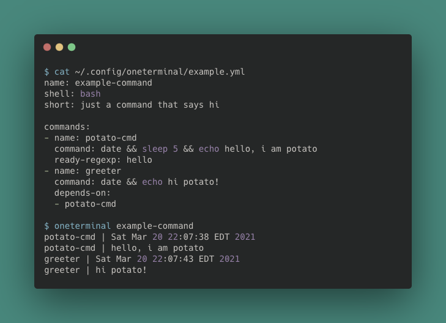

# oneterminal to rule them all!

A configurable CLI to run multiple terminal windows from a single command.


# Overview

oneterminal is a CLI written in [Go](https://golang.org/). Each command is configured in a YAML file stored in the ~/.config/oneterminal directory. For more details on how to configure a command, refer to [example configurations](#example-configurations).

# How to Install

If you have a local [Go installation](https://golang.org/doc/install):

For Go 1.16+ use [`go install`](https://golang.org/doc/go1.16#go-command):
```go
go install github.com/alexchao26/oneterminal@latest
```

For older Go versions:
```go
go get -u github.com/alexchao26/oneterminal
```

### From Github releases
Alternatively, you can download the binary directly from the [Github releases](https://github.com/alexchao26/oneterminal/releases).

Note that development was mostly on a Mac with `go version go1.15.6 darwin/amd` and some standard library packages (like [os/exec](https://golang.org/pkg/os/exec/)) do not have full support on Windows.

# Example Configurations

## Utilizing the example config generator
`oneterminal example` will create a config at ~/.config/oneterminal/example.yml containing helpful comments about each yaml field
```yaml
# The name of the command. Alphanumeric, dash and hyphens are accepted
name: somename

# shell to use (zsh|bash|sh), defaults to zsh
shell: zsh

# a short description of what this command does
short: an example command that says hello twice
# OPTIONAL: longer description of what this command does
long: Optional longer description

# An array of commands, each command consists of:
#   1. command {string}: the command to run directly in a shell
#   2. name {string default: ""}: used to prefix each line of this command's
#        output AND for other commands to list dependencies
#        NOTE: an empty string is a valid name and is useful for things like
#           vault which write to stdout in small chunks
#   3. directory {string, default: $HOME}: what directory to run the command in
#        NOTE: use $HOME, not ~. This strings gets passed through os.ExpandEnv
#   4. silence {boolean, default: false}, silence this command's output?
#   5. depends-on {[]string, optional}: which (names of) commands to wait for
#   6. ready-regexp {string, optional}: a regular expression that the outputs
#        must match for this command to be considered "ready" and for its
#        dependants to begin running
#   7. environment {map[string]string, optional} to set environment variables
commands:
- name: greeter-1
  command: echo hello from window 1
  directory: $HOME/go
  ready-regexp: "window [0-9]"
  silence: false
- name: greeter-2
  command: echo hello from window 2
  silence: false
  depends-on:
  - greeter-1
- name: ""
  command: echo "they silenced me :'("
  silence: true
```

This is an example of a slightly more complex configuration that calls a ticker program (in the [examples folder](./examples/ticker/main.go))
```yml
name: tick
short: a few tickers that rely on each other
commands:
- name: ticker-UNO
  command: go run main.go
  ready-regexp: "tick [5-9]"
  directory: $HOME/go/src/github.com/alexchao26/oneterminal/examples/ticker
- name: ticker-two
  command: SECONDS=3 go run main.go
  directory: $HOME/go/src/github.com/alexchao26/oneterminal/examples/ticker
  depends-on:
    - ticker-UNO
- name: ticker-3
  command: go run main.go
  directory: $HOME/go/src/github.com/alexchao26/oneterminal/examples/ticker
  depends-on:
    - silent-ticker
    - ticker-two
  environment:
    SECONDS: 8
- name: silent-ticker
  command: go run main.go
  directory: $HOME/go/src/github.com/alexchao26/oneterminal/examples/ticker
  silence: true
```

Run `oneterminal help` to see this command show up under available commands. Note that this command's name is set by the name field in example.yml.

# oneterminal Commands

Command                                  | Description
-----------------------------------------|--------------------------------------
`oneterminal example`                    | Makes a demo oneterminal config in ~/.config/oneterminal
`oneterminal completion --help`          | Get helper text to setup shell completion for zsh or bash shells
`oneterminal version`                    | Print the version number of oneterminal
`oneterminal help`                       | Help about any command
`oneterminal <your-configured-commands>` | Your commands configured via ~/.config/oneterminal/*.yml

# Contributing to oneterminal

This project is still in its infancy and its future path is undetermined.

I welcome contributions but ask that you open an issue to discuss bugs and desired features!
